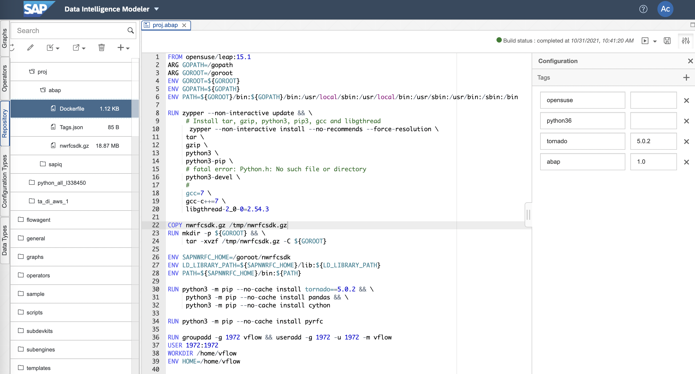

# ABAP Custom Operator Example

## 1. Build ABAP_RFC Docker(Container) Image

 

    1. Input dockerfile path : proj.abap
    
    2. Load file nwrfcsdk.gz into Repository
    
    3. Write Dockerfile
    FROM opensuse/leap:15.1
    ARG GOPATH=/gopath
    ARG GOROOT=/goroot
    ENV GOROOT=${GOROOT}
    ENV GOPATH=${GOPATH}
    ENV PATH=${GOROOT}/bin:${GOPATH}/bin:/usr/local/sbin:/usr/local/bin:/usr/sbin:/usr/bin:/sbin:/bin

    RUN zypper --non-interactive update && \
         # Install tar, gzip, python3, pip3, gcc and libgthread
          zypper --non-interactive install --no-recommends --force-resolution \
         tar \
         gzip \
         python3 \
         python3-pip \
         # fatal error: Python.h: No such file or directory
         python3-devel \
         #
         gcc=7 \
         gcc-c++=7 \
         libgthread-2_0-0=2.54.3

    COPY nwrfcsdk.gz /tmp/nwrfcsdk.gz
    RUN mkdir -p ${GOROOT} && \
         tar -xvzf /tmp/nwrfcsdk.gz -C ${GOROOT}

    ENV SAPNWRFC_HOME=/goroot/nwrfcsdk
    ENV LD_LIBRARY_PATH=${SAPNWRFC_HOME}/lib:${LD_LIBRARY_PATH}
    ENV PATH=${SAPNWRFC_HOME}/bin:${PATH}

    RUN python3 -m pip --no-cache install tornado==5.0.2 && \
         python3 -m pip --no-cache install pandas && \
         python3 -m pip --no-cache install cython

    RUN python3 -m pip --no-cache install pyrfc

    RUN groupadd -g 1972 vflow && useradd -g 1972 -u 1972 -m vflow
    USER 1972:1972
    WORKDIR /home/vflow
    ENV HOME=/home/vflow
    
    4. Write Tags.json
    {
        "opensuse": "",
        "python36": "",
        "tornado": "5.0.2",
        "c_abap": "1.0"
    }

## 2. ABAP Pipeline
### 2-1. Ingest ABAP_RFC into Files
 
Constant Generator --> Python3(Read ABAP_RFC) --> To File --> Write File --> Graph Terminator 

    def on_input(data):
        from pyrfc import Connection, ABAPApplicationError, ABAPRuntimeError, LogonError, CommunicationError
        from configparser import ConfigParser
        from pprint import PrettyPrinter

        ASHOST='xxx.xxx.xxx.xxx'
        CLIENT='100'
        SYSNR='40'
        USER='UserID'
        PASSWD='Password'
        conn = Connection(ashost=ASHOST, sysnr=SYSNR, client=CLIENT, user=USER, passwd=PASSWD)

        try:

            options = [{ 'TEXT': "FCURR = 'USD'"}]
            pp = PrettyPrinter(indent=4)
            ROWS_AT_A_TIME = 10
            rowskips = 0
            while True:
                print("----Begin of Batch---")
                result = conn.call('RFC_READ_TABLE', \
                QUERY_TABLE = 'TCURR', \
                OPTIONS = options, \
                ROWSKIPS = rowskips, ROWCOUNT = ROWS_AT_A_TIME)
                pp.pprint(result['DATA'])

                rowskips += ROWS_AT_A_TIME
                if len(result['DATA']) < ROWS_AT_A_TIME:
                    break
        except CommunicationError:
            print("Could not connect to server.")
            raise
        except LogonError:
            print("Could not log in. Wrong credentials?")
            raise
        except (ABAPApplicationError, ABAPRuntimeError):
            print("An error occurred.")
            raise

        conn.close()
        api.send("output", "Success")

    api.set_port_callback("input", on_input)

 

    def on_input(data):
        from pyrfc import Connection, ABAPApplicationError, ABAPRuntimeError, LogonError, CommunicationError
        from configparser import ConfigParser
        from pprint import PrettyPrinter

        ASHOST='xxx.xxx.xxx.xxx'
        CLIENT='100'
        SYSNR='40'
        USER='UserID'
        PASSWD='Password'
        conn = Connection(ashost=ASHOST, sysnr=SYSNR, client=CLIENT, user=USER, passwd=PASSWD)

        options = [{ 'TEXT': "FCURR = 'USD'"}]
        result = conn.call('RFC_READ_TABLE', \
                            QUERY_TABLE = 'TCURR', \
                            OPTIONS = options)
        # result : Dictionary Data Type

        out = str(result['DATA']) # List to String

        #import pandas as pd
        #df = pd.DataFrame(result['DATA']) # List to DataFrmae

        conn.close()
        api.send("output", out)

    api.set_port_callback("input", on_input)

### 2-2. Ingest Files into IQ
 
Read File --> From File --> Python3(Write IQ) --> Wiretap --> Graph Terminator

    from io import StringIO
    import pandas as pd
    import sqlanydb

    def on_input(msg):

        data = StringIO(msg.body.decode("utf-8"))

        df = pd.read_csv(data, sep=';')
        rows = df.values.tolist()
        #print(rows)

        # IQ
        parms = ("?," * len(rows[0]))[:-1]
        sql = "INSERT INTO runningtimes VALUES (%s)" % (parms)
        #print(sql)

        conn = sqlanydb.connect(uid='UserID', pwd='Password', eng='EngineName', dbn='DBName', host='xxx.xxx.xxx.xxx:2638')
        cursor = conn.cursor()

        cursor.executemany(sql, rows)

        cursor.close()
        conn.commit()
        conn.close()

        result = {"Number of Rows": str(len(rows))}
        api.send("output1", api.Message(result))

    api.set_port_callback("input1", on_input)

