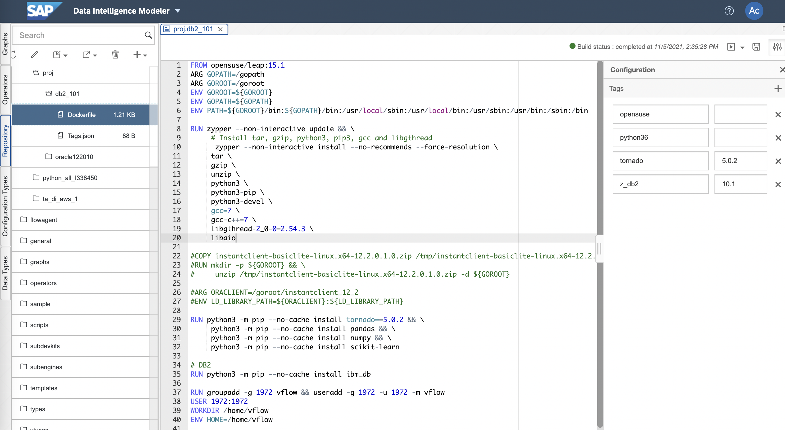

# DB2 Custom Operator 예제

## 1. Build DB2 Docker(Container) Image

 

    1. Input dockerfile path : proj.db2_101
    
    2. Write Dockerfile
    FROM opensuse/leap:15.1
    ARG GOPATH=/gopath
    ARG GOROOT=/goroot
    ENV GOROOT=${GOROOT}
    ENV GOPATH=${GOPATH}
    ENV PATH=${GOROOT}/bin:${GOPATH}/bin:/usr/local/sbin:/usr/local/bin:/usr/sbin:/usr/bin:/sbin:/bin

    RUN zypper --non-interactive update && \
         # Install tar, gzip, python3, pip3, gcc and libgthread
          zypper --non-interactive install --no-recommends --force-resolution \
         tar \
         gzip \
         unzip \
         python3 \
         python3-pip \
         python3-devel \
         gcc=7 \
         gcc-c++=7 \
         libgthread-2_0-0=2.54.3 \
         libaio

    #COPY instantclient-basiclite-linux.x64-12.2.0.1.0.zip /tmp/instantclient-basiclite-linux.x64-12.2.0.1.0.zip
    #RUN mkdir -p ${GOROOT} && \
    #     unzip /tmp/instantclient-basiclite-linux.x64-12.2.0.1.0.zip -d ${GOROOT}

    #ARG ORACLIENT=/goroot/instantclient_12_2
    #ENV LD_LIBRARY_PATH=${ORACLIENT}:${LD_LIBRARY_PATH}

    RUN python3 -m pip --no-cache install tornado==5.0.2 && \
         python3 -m pip --no-cache install pandas && \
         python3 -m pip --no-cache install numpy && \
         python3 -m pip --no-cache install scikit-learn

    # DB2
    RUN python3 -m pip --no-cache install ibm_db

    RUN groupadd -g 1972 vflow && useradd -g 1972 -u 1972 -m vflow
    USER 1972:1972
    WORKDIR /home/vflow
    ENV HOME=/home/vflow
    
    3. Write Tags.json
    {
        "opensuse": "",
        "python36": "",
        "tornado": "5.0.2",
        "z_db2": "10.1"
    }

## 2. DB2 Pipeline
### 2-1. Ingest DB2 into Files
 
Constant Generator --> Python3(Read DB2) --> To File --> Write File --> Graph Terminator 

    def on_input(data):
        import ibm_db
        import pandas as pd

        conn_str='database=dbname;hostname=xxx.xxx.xxx.xxx;port=12345;protocol=tcpip;uid=userid;pwd=userpw'
        ibm_db_conn = ibm_db.connect(conn_str,'','')

        import ibm_db_dbi
        conn = ibm_db_dbi.Connection(ibm_db_conn)

        select = "SELECT * FROM EMP"
        cur = conn.cursor()
        cur.execute(select)
        row=cur.fetchall()

        df = pd.DataFrame(row)
        #df.columns = ['ID','HALF','FULL']
        #print(df)
        result = df

        cur.close()
        ibm_db.close(ibm_db_conn)

        csv = result.to_csv(sep=',', index=False)
        api.send("output", csv)

    api.set_port_callback("input", on_input)

### 2-2. Ingest Files into DB2
 
Read File --> From File --> Python3(Write DB2) --> Wiretap --> Graph Terminator

    from io import StringIO
    import pandas as pd
    import sqlanydb

    def on_input(msg):

        data = StringIO(msg.body.decode("utf-8"))

        df = pd.read_csv(data, sep=';')
        rows = df.values.tolist()
        #print(rows)

        # IQ
        parms = ("?," * len(rows[0]))[:-1]
        sql = "INSERT INTO runningtimes VALUES (%s)" % (parms)
        #print(sql)

        conn = sqlanydb.connect(uid='User', pwd='Password', eng='EngineName', dbn='DBName', host='xxx.xxx.xxx.xxx:2638')
        cursor = conn.cursor()

        cursor.executemany(sql, rows)

        cursor.close()
        conn.commit()
        conn.close()

        result = {"Number of Rows": str(len(rows))}
        api.send("output1", api.Message(result))

    api.set_port_callback("input1", on_input)

