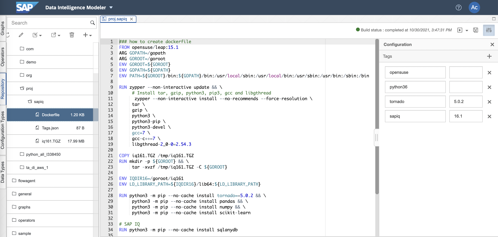

# IQ(HANA Data Lake) Custom Operator Example

## 1. Build IQ Docker(Container) Image

 

    1. Input dockerfile path : proj.sapiq
    
    2. Load file iq161.TGZ into Repository
    
    3. Write Dockerfile
    FROM opensuse/leap:15.1
    ARG GOPATH=/gopath
    ARG GOROOT=/goroot
    ENV GOROOT=${GOROOT}
    ENV GOPATH=${GOPATH}
    ENV PATH=${GOROOT}/bin:${GOPATH}/bin:/usr/local/sbin:/usr/local/bin:/usr/sbin:/usr/bin:/sbin:/bin

    RUN zypper --non-interactive update && \
         # Install tar, gzip, python3, pip3, gcc and libgthread
          zypper --non-interactive install --no-recommends --force-resolution \
         tar \
         gzip \
         python3 \
         python3-pip \
         python3-devel \
         gcc=7 \
         gcc-c++=7 \
         libgthread-2_0-0=2.54.3

    COPY iq161.TGZ /tmp/iq161.TGZ
    RUN mkdir -p ${GOROOT} && \
         tar -xvzf /tmp/iq161.TGZ -C ${GOROOT}

    ENV IQDIR16=/goroot/iq161
    ENV LD_LIBRARY_PATH=${IQDIR16}/lib64:${LD_LIBRARY_PATH}

    RUN python3 -m pip --no-cache install tornado==5.0.2 && \
         python3 -m pip --no-cache install pandas && \
         python3 -m pip --no-cache install numpy && \
         python3 -m pip --no-cache install scikit-learn

    # SAP IQ
    RUN python3 -m pip --no-cache install sqlanydb

    # SAP NW RFC
    #RUN python3 -m pip --no-cache install cython && \
    #     python3 -m pip --no-cache install pyrfc

    RUN groupadd -g 1972 vflow && useradd -g 1972 -u 1972 -m vflow
    USER 1972:1972
    WORKDIR /home/vflow
    ENV HOME=/home/vflow
    
    4. Write Tags.json
    {
        "opensuse": "",
        "python36": "",
        "tornado": "5.0.2",
        "sapiq": "16.1"
    }

## 2. IQ Pipeline
### 2-1. Ingest IQ to Files
 
Constant Generator --> Python3(Read IQ) --> To File --> Write File --> Graph Terminator 

    def on_input(data):
        import sqlanydb
        from pandas import DataFrame

        conn = sqlanydb.connect(uid='UserID', pwd='Password', eng='EngineName', dbn='DBName', host='xxx.xxx.xxx.xxx:2638')
        cursor = conn.cursor()

        sql = "SELECT * FROM runningtimes"
        cursor.execute(sql)

        rowset = cursor.fetchall()

        df = DataFrame(rowset)
        df.columns = ['ID','HALF','FULL']
        #print(df)
        result = df

        cursor.close()
        #conn.commit()
        conn.close()

        csv = result.to_csv(sep=',', index=False)

        api.send("output", csv)

    api.set_port_callback("input", on_input)

### 2-2. Ingest Files into IQ (Standard Operator)
 
Structured File Consumer --> Table Producer --> Graph Terminator
   

### 2-3. Ingest Files into IQ
 
Read File --> From File --> Python3(Write IQ) --> Wiretap --> Graph Terminator

    from io import StringIO
    import pandas as pd
    import sqlanydb

    def on_input(msg):

        data = StringIO(msg.body.decode("utf-8"))

        df = pd.read_csv(data, sep=';')
        rows = df.values.tolist()
        #print(rows)

        # IQ
        parms = ("?," * len(rows[0]))[:-1]
        sql = "INSERT INTO runningtimes VALUES (%s)" % (parms)
        #print(sql)

        conn = sqlanydb.connect(uid='UserID', pwd='Password', eng='EngineName', dbn='DBName', host='xxx.xxx.xxx.xxx:2638')
        cursor = conn.cursor()

        cursor.executemany(sql, rows)

        cursor.close()
        conn.commit()
        conn.close()

        result = {"Number of Rows": str(len(rows))}
        api.send("output1", api.Message(result))

    api.set_port_callback("input1", on_input)

