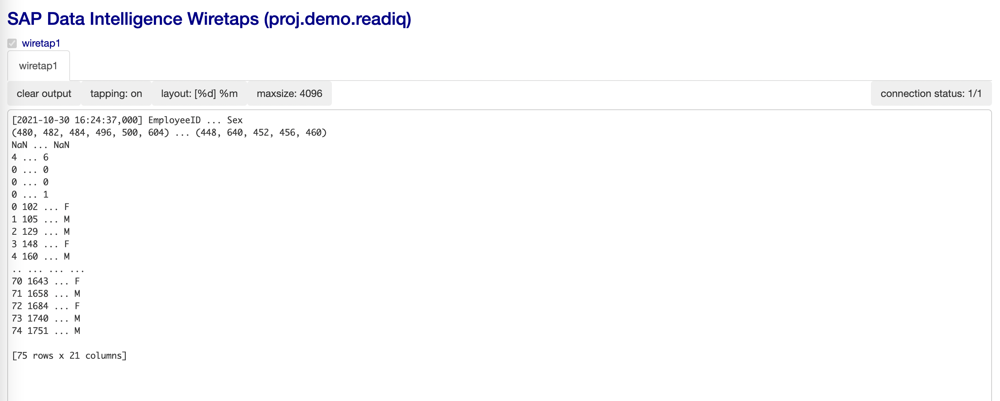

# IQ(HANA Data Lake) Custom Operator Example

## 1. Docker Image
    
    1. Input dockerfile path : proj.sapiq
    
    2. Load file iq161.TGZ into Repository
    
    3. Write Dockerfile
    FROM opensuse/leap:15.1
    ARG GOPATH=/gopath
    ARG GOROOT=/goroot
    ENV GOROOT=${GOROOT}
    ENV GOPATH=${GOPATH}
    ENV PATH=${GOROOT}/bin:${GOPATH}/bin:/usr/local/sbin:/usr/local/bin:/usr/sbin:/usr/bin:/sbin:/bin

    RUN zypper --non-interactive update && \
         # Install tar, gzip, python3, pip3, gcc and libgthread
          zypper --non-interactive install --no-recommends --force-resolution \
         tar \
         gzip \
         python3 \
         python3-pip \
         python3-devel \
         gcc=7 \
         gcc-c++=7 \
         libgthread-2_0-0=2.54.3

    COPY iq161.TGZ /tmp/iq161.TGZ
    RUN mkdir -p ${GOROOT} && \
         tar -xvzf /tmp/iq161.TGZ -C ${GOROOT}

    ENV IQDIR16=/goroot/iq161
    ENV LD_LIBRARY_PATH=${IQDIR16}/lib64:${LD_LIBRARY_PATH}

    RUN python3 -m pip --no-cache install tornado==5.0.2 && \
         python3 -m pip --no-cache install pandas && \
         python3 -m pip --no-cache install numpy && \
         python3 -m pip --no-cache install scikit-learn

    # SAP IQ
    RUN python3 -m pip --no-cache install sqlanydb

    # SAP NW RFC
    #RUN python3 -m pip --no-cache install cython && \
    #     python3 -m pip --no-cache install pyrfc

    RUN groupadd -g 1972 vflow && useradd -g 1972 -u 1972 -m vflow
    USER 1972:1972
    WORKDIR /home/vflow
    ENV HOME=/home/vflow
    
    4. Write Tags.json
    {
        "opensuse": "",
        "python36": "",
        "tornado": "5.0.2",
        "sapiq": "16.1"
    }
 

## 2. IQ Pipeline

    def on_input(data):
        import sqlanydb
        from pandas import DataFrame

        conn = sqlanydb.connect(uid='user', pwd='password', eng='host_iqdemo', dbn='iqdemo', host='xxx.xxx.xxx.xxx:2638' )
        cursor = conn.cursor()

        sql = "SELECT * FROM Employees"
        cursor.execute(sql)

        #desc = cursor.description
        #print(len(desc))

        rowset = cursor.fetchall()

        df = DataFrame(rowset)
        df.columns = desc
        print(df)

        cursor.close()
        conn.close()

        api.send("output", str(df))

    api.set_port_callback("input", on_input)

 
 
