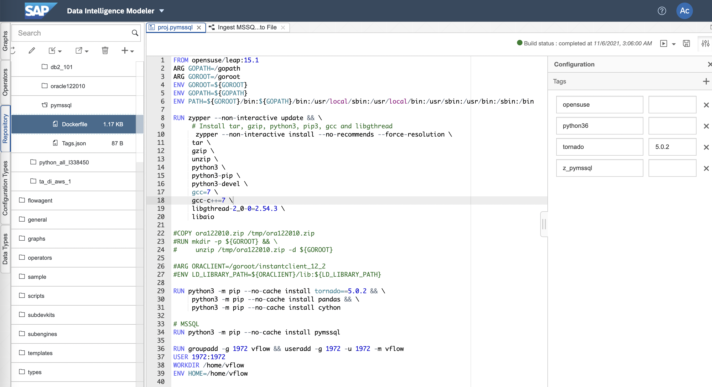

# MSSQL Custom Operator 예제

## 1. Build MSSQL Docker(Container) Image

 

    1. Input dockerfile path : proj.mssql
    
    2. Load file ora122010.zip into Repository
    
    3. Write Dockerfile
    FROM opensuse/leap:15.1
    ARG GOPATH=/gopath
    ARG GOROOT=/goroot
    ENV GOROOT=${GOROOT}
    ENV GOPATH=${GOPATH}
    ENV PATH=${GOROOT}/bin:${GOPATH}/bin:/usr/local/sbin:/usr/local/bin:/usr/sbin:/usr/bin:/sbin:/bin

    RUN zypper --non-interactive update

    # Install python3, pip3, and gcc
    RUN zypper --non-interactive install --no-recommends --force-resolution \
        curl \
        python3 \
        python3-pip \
        python3-devel \
        gcc=7 \
        gcc-c++=7 \
        #libgthread-2_0-0=2.54.3 \
        unixODBC-devel

    RUN curl -O https://packages.microsoft.com/keys/microsoft.asc
    RUN rpm --import microsoft.asc
    RUN zypper ar https://packages.microsoft.com/config/sles/15/prod.repo
    RUN ACCEPT_EULA=Y zypper --non-interactive install --no-recommends --force-resolution \
                      msodbcsql17

    # Configre PATH, LD_LIBRARY_PATH and etc
    # ENV PATH=
    # ENV LD_LIBRARY_PATH=${IQDIR16}/lib64:${LD_LIBRARY_PATH}

    # Python package
    RUN python3 -m pip --no-cache install tornado==5.0.2 && \
        python3 -m pip --no-cache install pandas && \
        python3 -m pip --no-cache install numpy && \
        python3 -m pip --no-cache install scikit-learn

    # MSSQL package
    RUN python3 -m pip --no-cache install pyodbc pymssql

    RUN groupadd -g 1972 vflow && useradd -g 1972 -u 1972 -m vflow
    USER 1972:1972
    WORKDIR /home/vflow
    ENV HOME=/home/vflow

    4. Write Tags.json
    {
        "opensuse": "",
        "python36": "",
        "tornado": "5.0.2",
        "z_mssql": ""
    }

## 2. MSSQL Pipeline
### 2-1. Ingest MSSQL into Files
 
Constant Generator --> Python3(Read MSSQL) --> To File --> Write File --> Graph Terminator 

    def on_input(data):
        import pymssql
        import pandas as pd

        conn = pymssql.connect(server='xxx.xxx.xxx.xxx', user='userid', password='userpw', database='dbname')

        select = 'SELECT * FROM Products;'
        cursor = conn.cursor()
        cursor.execute(select)
        row = cursor.fetchall()
        #print(row)

        df = pd.DataFrame(row)
        #df.columns = ['ID','HALF','FULL']
        #print(df)
        result = df

        cursor.close()
        conn.close()

        csv = result.to_csv(sep=',', index=False)
        api.send("output", csv)

    api.set_port_callback("input", on_input)

    import pyodbc
    # Some other example server values are
    # server = 'localhost\sqlexpress' # for a named instance
    # server = 'myserver,port' # to specify an alternate port
    server = 'tcp:52.29.170.204'
    database = 'TA'
    username = 'sa'
    password = 'PTAcademy!'
    cnxn = pyodbc.connect('DRIVER={ODBC Driver 17 for SQL Server};SERVER='+server+';DATABASE='+database+';UID='+username+';PWD='+ password)
    cursor = cnxn.cursor()

    #cursor.execute("SELECT @@version;") 
    cursor.execute("SELECT * from Products;")
    row = cursor.fetchall()
    print(row)

    cursor.close()
    cnxn.close()

### 2-2. Ingest Files into MSSQL
 
Read File --> From File --> Python3(Write MSSQL) --> Wiretap --> Graph Terminator

    from io import StringIO
    import pandas as pd
    import sqlanydb

    def on_input(msg):

        data = StringIO(msg.body.decode("utf-8"))

        df = pd.read_csv(data, sep=';')
        rows = df.values.tolist()
        #print(rows)

        # IQ
        parms = ("?," * len(rows[0]))[:-1]
        sql = "INSERT INTO runningtimes VALUES (%s)" % (parms)
        #print(sql)

        conn = sqlanydb.connect(uid='User', pwd='Password', eng='EngineName', dbn='DBName', host='xxx.xxx.xxx.xxx:2638')
        cursor = conn.cursor()

        cursor.executemany(sql, rows)

        cursor.close()
        conn.commit()
        conn.close()

        result = {"Number of Rows": str(len(rows))}
        api.send("output1", api.Message(result))

    api.set_port_callback("input1", on_input)

