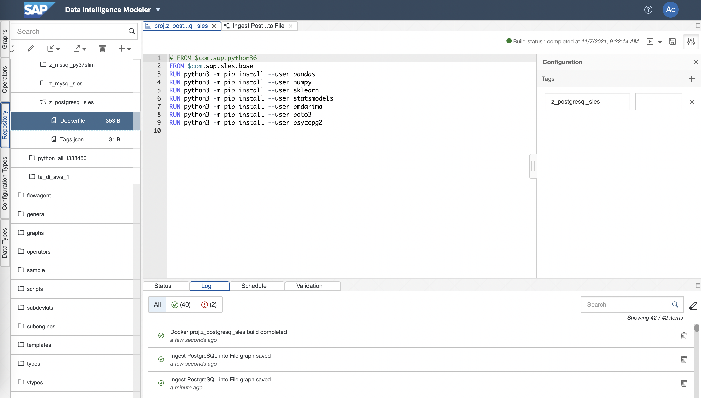

# PostgreSQL Custom Operator 예제

## 1. Build PostgreSQL Docker(Container) Image

 

    1. Input dockerfile path : proj.z_postgresql_sles
    
    2. Write Dockerfile
    # FROM $com.sap.python36
    FROM $com.sap.sles.base
    RUN python3 -m pip install --user pandas
    RUN python3 -m pip install --user numpy
    RUN python3 -m pip install --user sklearn
    RUN python3 -m pip install --user statsmodels
    RUN python3 -m pip install --user pmdarima
    RUN python3 -m pip install --user boto3
    RUN python3 -m pip install --user psycopg2

    3. Write Tags.json
    {
        "z_postgresql_sles": ""
    }

## 2. MySQL Pipeline
### 2-1. Ingest PostgreSQL into Files
 
Constant Generator --> Python3(Read PostgreSQL) --> To File --> Write File --> Graph Terminator 

    def on_input(data):
        import psycopg2
        import pandas as pd

        conn = psycopg2.connect(host='localhost',dbname='testdb',user='postgres',password='password',port=5432)

        sql = "select * from TEST"

        cursor = conn.cursor()
        cursor.execute(sql)
        row = cursor.fetchall()
        #print(row)

        df = pd.DataFrame(row)
        #df.columns = ['ID','HALF','FULL']
        #print(df)
        result = df

        cursor.close()
        conn.close()

        csv = result.to_csv(sep=',', index=False)
        api.send("output", csv)

    api.set_port_callback("input", on_input)

### 2-2. Ingest Files into PostgreSQL
 
Read File --> From File --> Python3(Write PostgreSQL) --> Wiretap --> Graph Terminator

    from io import StringIO
    import pandas as pd
    import sqlanydb

    def on_input(msg):

        data = StringIO(msg.body.decode("utf-8"))

        df = pd.read_csv(data, sep=';')
        rows = df.values.tolist()
        #print(rows)

        # IQ
        parms = ("?," * len(rows[0]))[:-1]
        sql = "INSERT INTO runningtimes VALUES (%s)" % (parms)
        #print(sql)

        conn = sqlanydb.connect(uid='User', pwd='Password', eng='EngineName', dbn='DBName', host='xxx.xxx.xxx.xxx:2638')
        cursor = conn.cursor()

        cursor.executemany(sql, rows)

        cursor.close()
        conn.commit()
        conn.close()

        result = {"Number of Rows": str(len(rows))}
        api.send("output1", api.Message(result))

    api.set_port_callback("input1", on_input)

