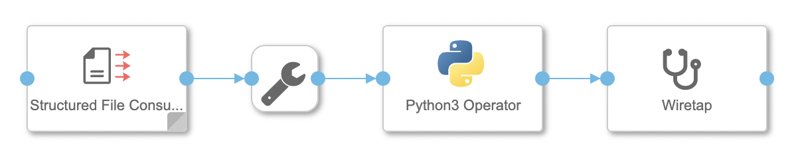
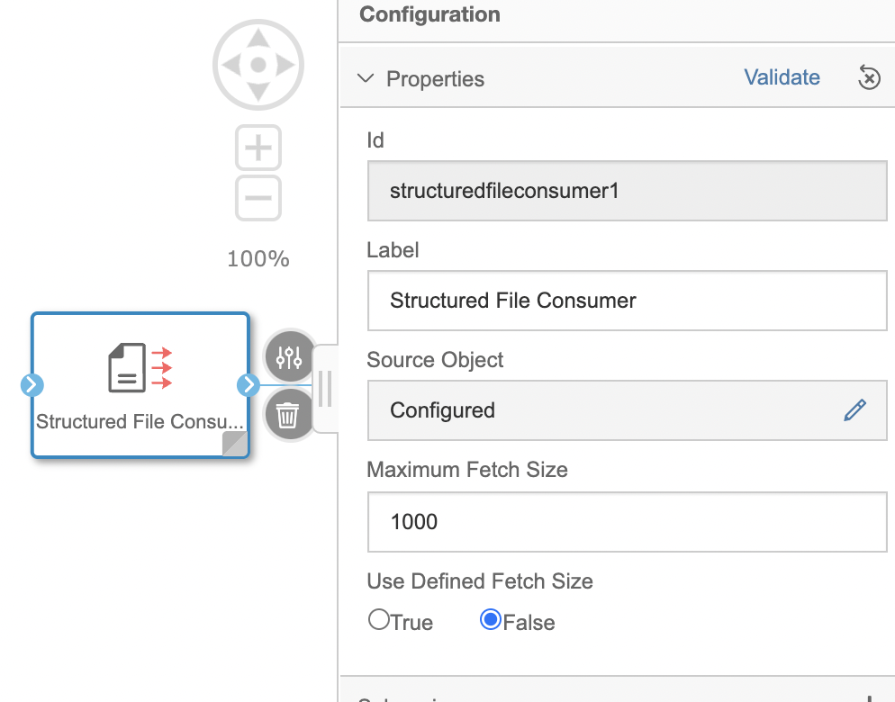
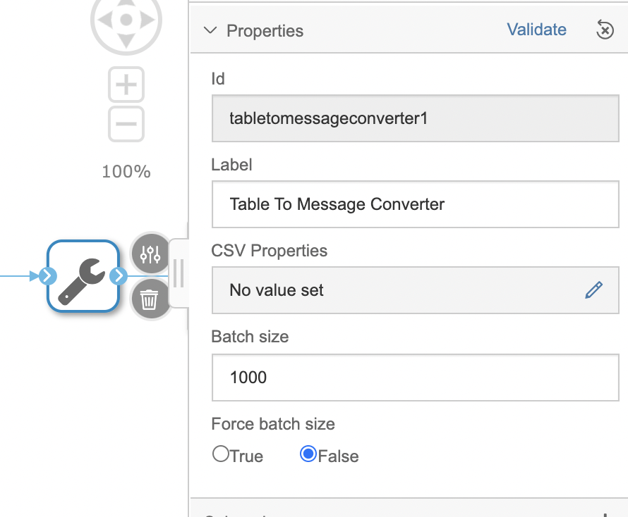
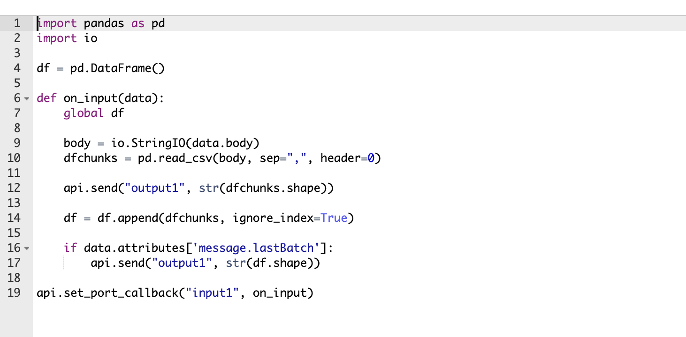
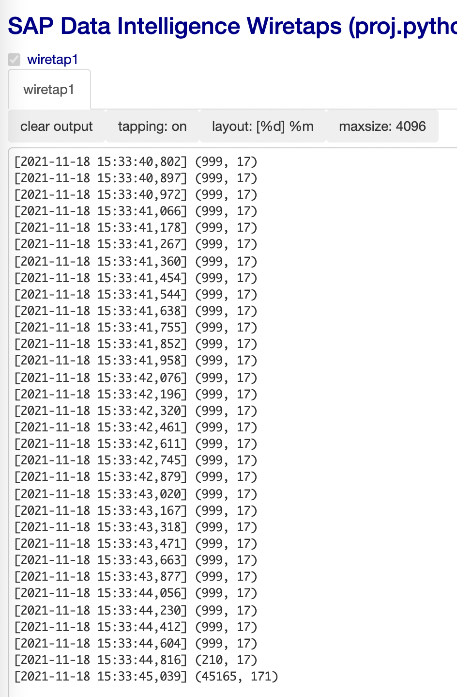

# 대용량 데이터 배치 처리 예제

파일 데이터를 읽어서 Python에서 배치 처리 파이프라인<br>


Structured File Comsumer Operator 설정<br>
User Defined Fetch Size를 False(default)로 설정하면, 자동으로 10 ~ 1000 사이로 Batch Size를 설정합니다.<br>
만약, True로 설정하면 Maxium Fetch Size 값을 사용합니다.<br>



Table to Message Coverter Operator 설정<br>
Force batch size를 True로 설정하면 Batch size 값을 사용합니다.<br>



Python3 Operator 스크립트<br>
입력 Batch Size의 Shape를 출력합니다.<br>



```shell
import pandas as pd
import io

df = pd.DataFrame()

def on_input(data):
    global df
    
    body = io.StringIO(data.body)
    dfchunks = pd.read_csv(body, sep=",", header=0)

    api.send("output1", str(dfchunks.shape))
    
    df = df.append(dfchunks, ignore_index=True)
    
    if data.attributes['message.lastBatch']:
        api.send("output1", str(df.shape))
    
api.set_port_callback("input1", on_input)
```

Wire Oprator<br>
입력된 Batch Size의 크기를 출력합니다.<br>


